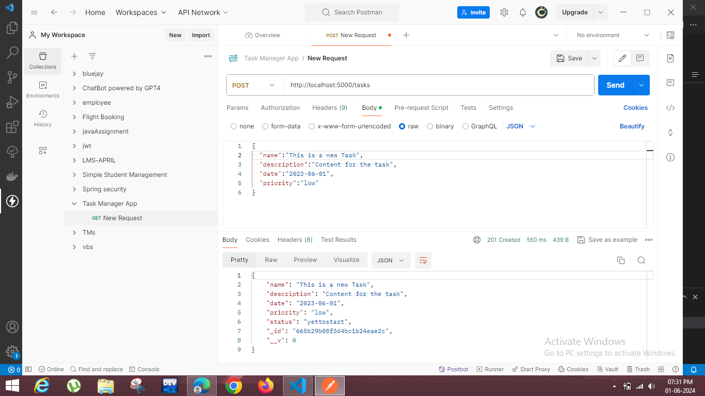
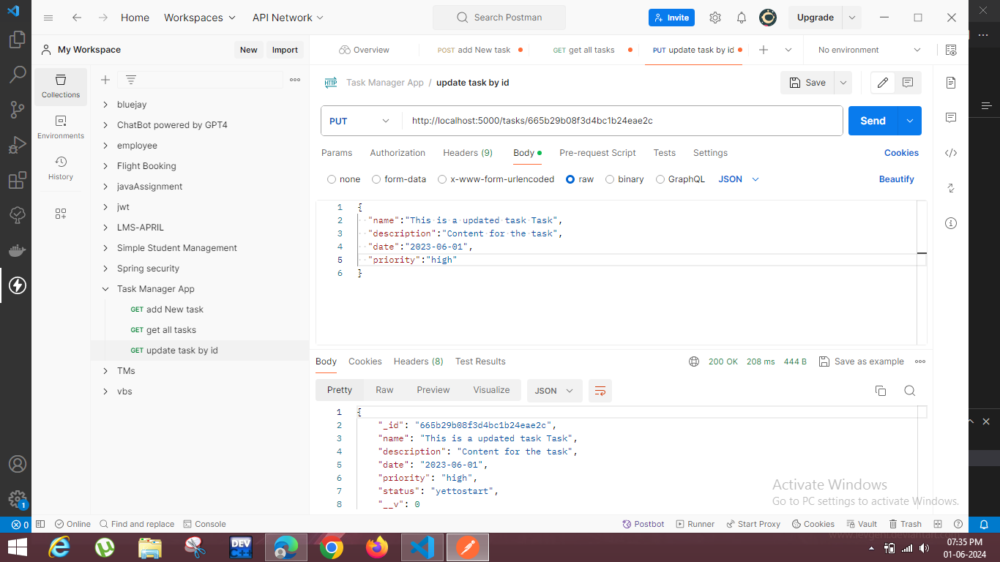
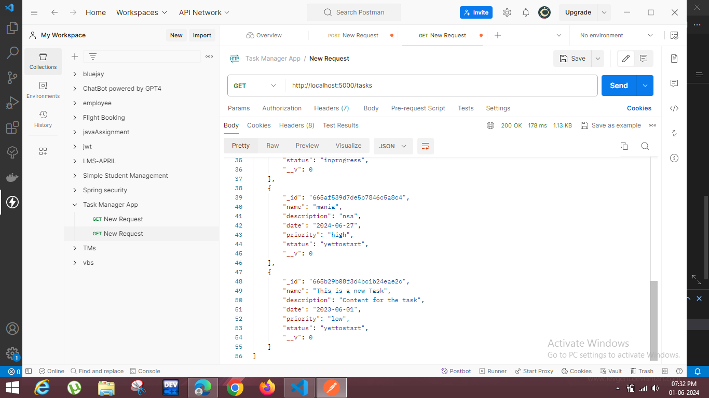
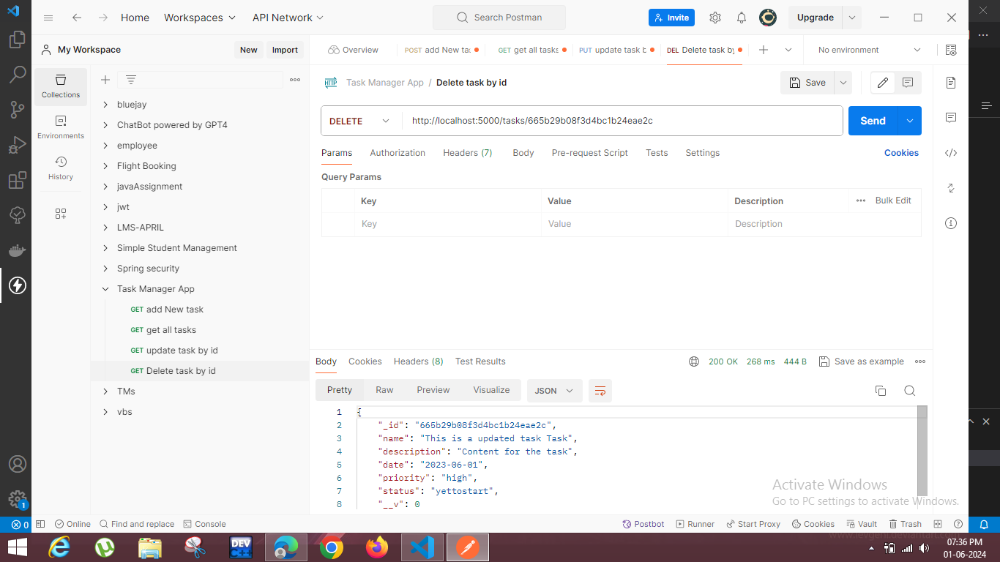

# Netlify Deployed Link
## [Click Here](https://mellow-daifuku-52bc64.netlify.app/)
### Note:server folder is deployed on render

# MERN Task Management App

This is a simple Task Management application built with the MERN stack (MongoDB, Express, React, Node.js). The application allows users to create, read, update, and delete tasks.

## Technologies Used

- **Frontend**: React
- **Backend**: Node.js, Express
- **Database**: MongoDB
- **Deployment**: Netlify (Frontend), Render (Backend)

## Features

- Add a new task
- Update an existing task
- Display all tasks
- Delete a task

## API Endpoints
-Add Task: POST /tasks
-Update Task: PUT /tasks/:id
-Get All Tasks: GET /tasks
-Delete Task: DELETE /tasks/:id

## Demo Video
Watch the demo video [here](https://drive.google.com/file/d/1g9n9OGZIiC8HFssdVjETdcUr089KTRX6/view?usp=drivesdk).

# Postman API Testing
Below are screenshots from Postman demonstrating the API endpoints.

### Update Task

### Display All Tasks

### Delete Task

$ Demo Video
Watch the demo video [here](https://drive.google.com/file/d/1g9n9OGZIiC8HFssdVjETdcUr089KTRX6/view?usp=drivesdk).
